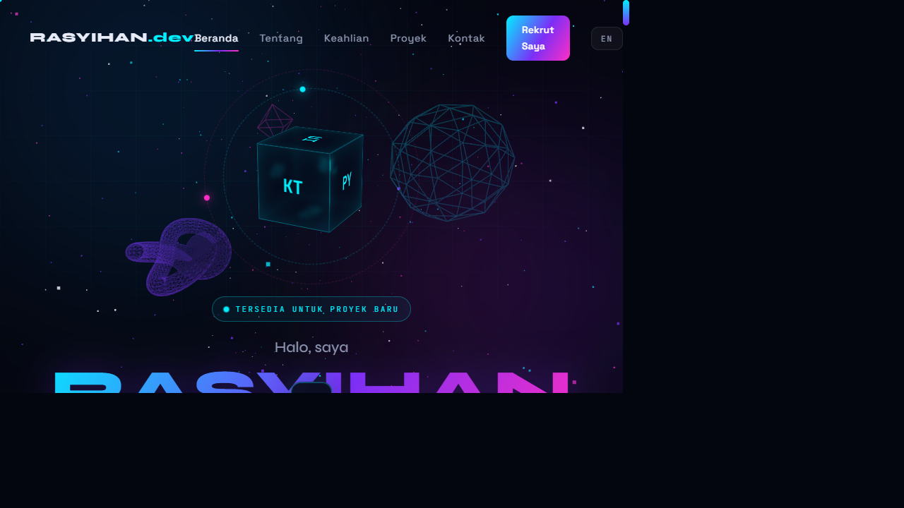

# Portofolio 3D — Andi Rasyihan Jawahir

> Portofolio interaktif dengan latar 3D WebGL, glassmorphism, dan dukungan dwibahasa (ID/EN).

**Lihat langsung:** [andirasyihan.github.io/portofolio-3d](https://andirasyihan.github.io/portofolio-3d/)



## Fitur

- **Latar 3D real-time** — 1.800 partikel WebGL + geometri wireframe (icosahedron, torus knot, octahedron) yang bereaksi terhadap gerakan mouse dan scroll
- **Kubus CSS 3D** berputar dengan cincin orbit
- **Dwibahasa ID/EN** — toggle satu klik, preferensi tersimpan di `localStorage`
- **Kursor kustom & tombol magnetik** — interaksi mikro di seluruh halaman
- **Glassmorphism + efek glitch** — estetika futuristik yang konsisten
- **Sepenuhnya responsif** — teruji dari 320px sampai 1920px
- **SEO siap pakai** — Open Graph, Twitter Card, dan JSON-LD Person schema
- **Tanpa framework, tanpa build step** — buka `index.html` dan selesai

## Teknologi

| Bagian    | Teknologi                                    |
| --------- | -------------------------------------------- |
| 3D/WebGL  | [Three.js](https://threejs.org/) r128        |
| Markup    | HTML5 semantik                               |
| Styling   | CSS3 murni (custom properties, grid, flex)   |
| Interaksi | Vanilla JavaScript (tanpa dependensi)        |
| Font      | Syne · Space Grotesk · JetBrains Mono        |
| Hosting   | GitHub Pages                                 |

## Menjalankan Secara Lokal

```bash
git clone https://github.com/AndiRasyihan/portofolio-3d.git
cd portofolio-3d
# buka index.html di browser — tidak perlu install apa pun
```

## Struktur

```
├── index.html   # Struktur halaman + konten
├── style.css    # Seluruh styling & animasi
├── script.js    # Scene Three.js, i18n, interaksi
├── favicon.svg  # Ikon situs
└── img/         # Foto & aset gambar
```

## Kontak

- Email: [andirasyihan43289@gmail.com](mailto:andirasyihan43289@gmail.com)
- LinkedIn: [Andi Rasyihan Jawahir](https://www.linkedin.com/in/andi-rasyihan-0296833aa/)
- Instagram: [@andi_rasyihan](https://instagram.com/andi_rasyihan)

---

© 2026 Andi Rasyihan Jawahir — dirakit dengan kopi & kode.
